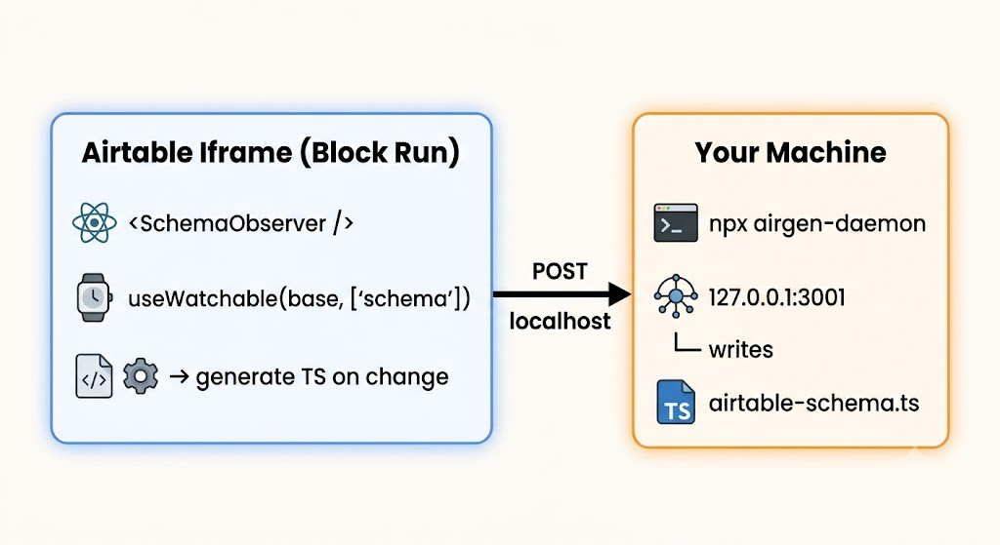

# airgen

Reactive TypeScript type generator for [Airtable Custom Extensions](https://airtable.com/developers/extensions).

A `<SchemaObserver />` component inside your extension watches the base schema via the Blocks SDK and streams generated types to a local daemon that writes `airtable-schema.ts` to disk.

This library does code generation on top of the [official Airtable Blocks SDK](https://github.com/Airtable/blocks), so no API tokens and no manual regeneration are needed.



Because the schema comes from the live `Base` model, generation reacts to *every* schema mutation — renaming a field, changing a field type, adding a select choice — within ~1 second, while `block run` hot-reloads your extension with the fresh types.

## Requirements

airgen is **not** a standalone Airtable client — it only works inside a custom extension built with the Airtable Blocks SDK, and it's meant to be used alongside it while you build custom interfaces on top of your base.

- [`@airtable/blocks`](https://github.com/Airtable/blocks) `>= 1.10.0` — required peer dependency. airgen reads the schema through the SDK's live `Base` model and its hooks are thin wrappers over SDK records.
- `react >= 16.14` — required peer dependency (the observer and the generated hooks are React).
- Node `>= 18` for the CLI/daemon.
- An extension scaffolded with the [Airtable CLI](https://airtable.com/developers/extensions) (`block init`), run locally with `block run`.

Everything airgen emits is typed against **`record.getCellValue(field)`** in the Blocks SDK, so the generated types only make sense in an SDK context. There is no REST API path and no Airtable personal access token anywhere in this package.

## Setup

The SDK and React come from the extension scaffold, so you never install them by hand — scaffold with the Airtable CLI first, then add airgen to that project. For an interface extension, the hello-world template is the quickest start:

```sh
npm install -g @airtable/blocks-cli
block init NONE/<your-block-id> --template=https://github.com/Airtable/interface-extensions-hello-world <your-interface-project-name>
```

`block init` takes a `<baseId>/<blockId>` identifier. Interface extensions aren't scoped to a single base, so there's no base ID to give — the literal `NONE` is the CLI's placeholder for that slot (it accepts a base ID only if it starts with `app`, or exactly `NONE`). Get `<your-block-id>` (a `blk…` ID) from Builder Hub when you create the extension.

Then, inside that project:

```sh
npm install --save-dev airgen
```

**1. Start dev through airgen (it runs `block run` for you):**

```sh
npx airgen                        # starts the schema daemon, then `block run`
npx airgen -p 3005 -o src/airtable-schema.ts
npx airgen -- --port 9001         # args after -- are passed to `block run`
```

The daemon lives inside the same process as `block run` and exits the moment
it exits, so stopping dev (ctrl-C) never leaves anything running. If you'd
rather manage `block run` yourself, `npx airgen --daemon-only` starts just
the daemon.

**2. Render the observer in your extension (dev only):**

```tsx
import {SchemaObserver} from 'airgen';

function App() {
  return (
    <>
      <SchemaObserver />  {/* remove or enabled={false} before release */}
      <MyExtension />
    </>
  );
}
```

The panel shows daemon connection status, table count, last sync time, and a "Copy schema" clipboard fallback for when the daemon isn't running.

**3. Import the hooks straight from the generated file:**

```tsx
// anywhere in your extension
import {useRecords} from './airtable-schema';

const projects = useRecords('Projects'); // table key is autocompleted & validated

projects[0]?.fields.Status?.name;   // "Todo" | "In Progress" | "Done"
projects[0]?.fields.Owner?.email;   // string | undefined
projects[0]?.fields.Tasks?.[0].id;  // linked record id
projects[0]?.raw;                   // native SDK Record, escape hatch
```

The generated file binds the hooks itself (`export const {useRecords, useTable} = createTypedHooks<TableRecordMap>(airgenMeta)`), so there's no wiring step — and it works from plain JS too: the generic lives inside the generated file, so `useRecords('Projects')` in a `.js` file still gets full autocomplete and field types from the editor's TypeScript service.

Commit `airtable-schema.ts` — it's the source of truth when no dev session is running (CI, teammates without the base open).

## What gets generated

- One `export interface <Table>Record` per table, field keys matching Airtable field names (quoted when needed), all optional (empty cells are `null` in Airtable).
- Value types mirror **what `record.getCellValue(field)` returns in the Blocks SDK** — not the flatter REST API shapes:
  - selects → literal unions of `{ id: "sel…"; name: "…"; color?: string }`, with a named alias per field (e.g. `ProjectsStatusChoice`)
  - record links → `Array<{ id, name }>`, collaborators → `{ id, email?, name?, profilePicUrl? }`, attachments with thumbnails
  - formulas/rollups/lookups resolve to their computed result type
- `airgenMeta` — a `const` map of every table/field/choice **ID**.
- `TableRecordMap` + `TableKey` for hook inference.
- `useRecords` / `useTable` — hooks already bound to the schema, imported directly from the generated file.

### Rename survival

TypeScript types are erased at compile time, so no tool can "update types at runtime" — what airgen does instead:

- `useRecords` resolves tables and fields **by ID** from `airgenMeta`, so renaming a table, field, or select choice in Airtable never breaks the running extension.
- The observer notices the same schema event and regenerates the file, so the *display names* in your types refresh automatically while you develop.
- Deleted fields are skipped gracefully; a deleted table yields `[]`.

### Efficiency

Three gates keep this cheap:

1. `useWatchable(base, ['schema'])` — the observer re-renders **only** on schema mutations, never on record/cell data changes. Keep it a leaf component.
2. A canonical schema signature (FNV-1a) is compared before doing anything — no-op events skip generation entirely.
3. Generation runs inside a 500 ms debounce, so a burst of edits costs one generation + one POST. The daemon also skips disk writes when content is unchanged.

## Daemon security

Any webpage you visit can fire blind cross-origin POSTs at localhost, so the daemon is deliberately locked down:

- binds `127.0.0.1` only
- the output path is fixed at startup (`--out`); client-supplied paths in the payload are **ignored**
- payloads must be bounded (< 2 MB) strings starting with the airgen header, or they're rejected without writing

## Production

Remove `<SchemaObserver />` (or pass `enabled={false}`) before releasing. If it ships anyway, a released extension runs from a non-localhost origin, so browsers block the localhost request and the panel just shows "Disconnected" — nothing breaks and nothing is sent anywhere.

## API

| Export | Description |
|---|---|
| `SchemaObserver` | Dev panel component. Props: `daemonUrl` (default `http://localhost:3001`), `debounceMs` (500), `enabled` (true). |
| `useRecords` / `useTable` (from the **generated file**) | The hooks you actually use — pre-bound to your schema by the generated `airtable-schema.ts`. |
| `createTypedHooks<M>(airgenMeta)` | Runtime the generated file calls to bind the hooks; only needed for custom setups. |
| `generateTypeScriptFromBase(base, {hooksModule?})` | The pure generator, if you want to build your own sync flow. `hooksModule` overrides the import specifier baked into the generated file (default `'airgen'`). |
| `computeSchemaSignature(base)` | Canonical schema hash used for change detection. |
| `airgen` (bin) | `npx airgen [--port <n>] [--out <path>] [--daemon-only] [-- <block run args>]` — wraps `block run`, daemon exits with it. Health check at `GET /health`. |
